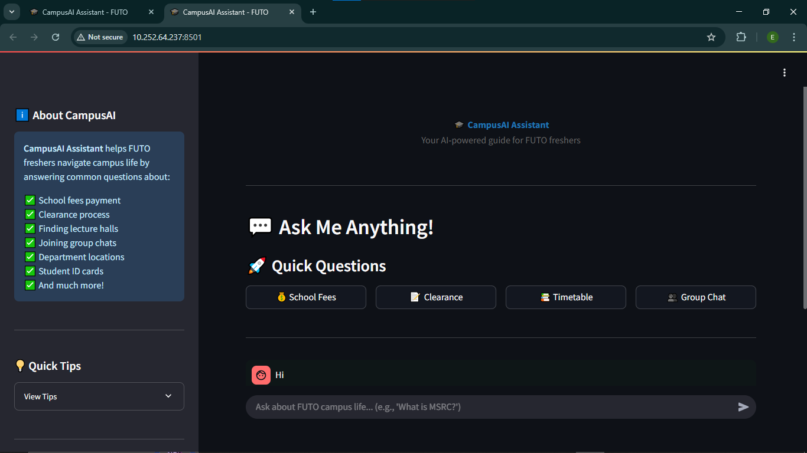

# 🎓 CampusAI Assistant

An AI-powered chatbot designed to help freshers navigate campus life at the Federal University of Technology Owerri (FUTO). Built for the [Hackathon Name] using FastAPI, Node.js, and Streamlit.



## 🌟 Features

- **Intelligent Q&A System**: Answers common questions about campus life using smart keyword matching
- **Context-Aware Follow-ups**: Understands follow-up questions without repeating context
- **FUTO-Specific Knowledge**: Tailored information for FUTO students
- **Origin SDK Integration**: Blockchain-based social authentication via Camp Network
- **Real-time Responses**: Fast and accurate answers to student queries
- **User-Friendly Interface**: Clean Streamlit UI with quick action buttons

## 🎯 Problem Statement

Freshers often struggle to find accurate information about:
- School fees payment process
- Clearance procedures
- Lecture hall locations
- Department group chats
- Student services and facilities

CampusAI Assistant solves this by providing instant, accurate answers 24/7.

## 💡 What It Does

CampusAI Assistant helps students with:
- 💰 **School Fees**: Payment process and portal access
- 📝 **Clearance**: Location and required documents
- 📚 **Academic Info**: Timetables, lecture halls, registration
- 👥 **Student Life**: Group chats, MSRC contacts, department info
- 🏢 **Campus Navigation**: Building locations and facilities
- 🆔 **Student Services**: ID cards, library, hostels

## 🛠️ Tech Stack

### Backend
- **FastAPI**: RESTful API with async support
- **Python 3.x**: Core backend logic
- **Pydantic**: Data validation and settings management

### Microservice
- **Node.js + Express**: Origin SDK integration
- **Origin SDK**: Blockchain social authentication (Camp Network)

### Frontend
- **Streamlit**: Interactive web interface
- **Session Management**: Conversation tracking

### Storage
- **JSON**: Knowledge base storage
- **In-memory**: Conversation context

## 📁 Project Structure
```
CampusAI_Assistant/
├── Hackathon_Project/
│   ├── fastapi_backend/
│   │   ├── main.py                 # FastAPI application
│   │   ├── config.py               # Configuration
│   │   ├── campus_knowledge.json   # FUTO knowledge base
│   │   ├── routers/
│   │   │   ├── chat.py            # Chat endpoints
│   │   │   └── auth.py            # Auth endpoints
│   │   ├── services/
│   │   │   ├── ai_service.py      # AI logic
│   │   │   └── origin_service.py  # Origin SDK calls
│   │   └── models/
│   │       └── schemas.py         # Pydantic models
│   │
│   ├── node_microservice/
│   │   ├── server.js              # Express server
│   │   └── package.json
│   │
│   └── streamlit_app/
│       └── app.py                 # Streamlit interface
```

## 🚀 Setup Instructions

### Prerequisites
- Python 3.8+
- Node.js 14+
- npm or yarn

### 1. Clone the Repository
```bash
git clone https://github.com/EnyinnayaDev/CampusAI_Assistant.git
cd CampusAI_Assistant/Hackathon_Project
```

### 2. Setup Node Microservice
```bash
cd node_microservice
npm install
```

Create `.env` file:
```env
ORIGIN_CLIENT_ID=your_client_id
ORIGIN_API_KEY=your_api_key
PORT=5000
```

Start the service:
```bash
node server.js
```

### 3. Setup FastAPI Backend
```bash
cd ../fastapi_backend
python -m venv venv
venv\Scripts\activate  # On Windows
# source venv/bin/activate  # On Mac/Linux

pip install -r requirements.txt
```

Create `.env` file:
```env
NODE_SERVICE_URL=http://localhost:5000
API_PORT=8000
DEBUG=True
```

Start the server:
```bash
python main.py
```

### 4. Setup Streamlit Frontend
```bash
cd ../streamlit_app
pip install streamlit
streamlit run app.py
```

### 5. Access the Application
- **Streamlit UI**: http://localhost:8501
- **FastAPI Docs**: http://localhost:8000/docs
- **Node Service**: http://localhost:5000/health

## 📖 Usage

1. Open the Streamlit interface at http://localhost:8501
2. Ask questions naturally:
   - "How do I pay school fees?"
   - "Where do I do clearance?"
   - "What is MSRC?"
3. Use quick action buttons for common questions
4. Ask follow-up questions - the bot remembers context!

## 🎬 Demo

[Demo Video Link](https://twitter.com/yourhandle/status/...)

## 🔑 Key Features Explained

### Smart Keyword Matching
Uses contextual keyword mapping to understand various phrasings of the same question.

### Follow-up Context Tracking
Maintains conversation history to answer follow-up questions intelligently without requiring users to repeat context.

### Origin SDK Integration
Integrates Camp Network's Origin SDK for blockchain-based social authentication (Twitter, Spotify, TikTok).

## 🌐 API Endpoints

### Chat Endpoints
- `POST /chat/ask` - Ask a question
- `GET /chat/categories` - Get all question categories
- `GET /chat/tips` - Get quick tips for freshers

### Auth Endpoints
- `GET /auth/socials` - Get linked social accounts
- `GET /auth/twitter/{username}` - Get Twitter user data

### Health Check
- `GET /health` - System health status

## 🤝 Contributing

This project was built for [Hackathon Name]. Contributions are welcome!

## 👨‍💻 Author

**Your Name**
- GitHub: [@EnyinnayaDev](https://github.com/EnyinnayaDev)
- Twitter: [@Dev_Enyinnaya](https://twitter.com/Dev_Enyinnaya)
- LinkedIn: [Ekeoma Chibuzo-Eke](https://linkedin.com/in/ekeoma-chibuzo-eke)

## 📝 License

This project is open source and available under the [MIT License](LICENSE).

## 🙏 Acknowledgments

- Federal University of Technology Owerri (FUTO)
- Camp Network for Origin SDK
- [TechyJaunt] organizers
- FUTO Software Engineering Department

## 📞 Support

For questions or support, contact [your email] or open an issue on GitHub.

---

**Built with ❤️ for FUTO Freshers | #20DaysOfCode Challenge**
